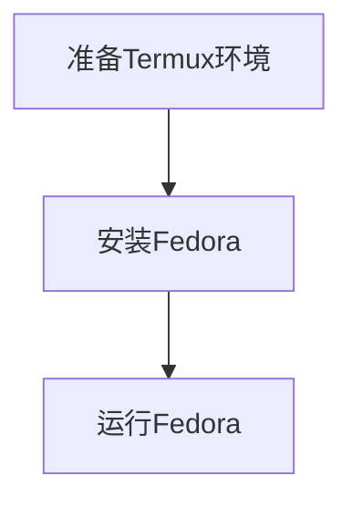

---
{"dg-publish":true,"permalink":"/Spaces/2-Areas/Linux/Fedora/Termux安装Fedora指南/使用proot-distro安装/"}
---

# 目录
- [前言](#前言)
- [正文](#正文)
	- [步骤1：准备Termux环境](#步骤1：准备Termux环境)
	- [步骤2：安装Fedora](#步骤2：安装Fedora)
	- [步骤3：运行Fedora](#步骤3：运行Fedora)
- [操作流程图解](#操作流程图解)
- [以后启动Fedora的操作](#以后启动Fedora的操作)
# 前言
1. 由于Termux不兼容RHEL，只能安装社区版的红帽Linux：Fedora。
2. 在代码块的右上角有一个图标，点击即可复制代码块内的内容。
3. 此方案使用proot-distro安装Fedora。

***

# 正文
## 步骤1：准备Termux环境
1. 更新包列表并升级现有包：

中途需要输两次y。
```bash
pkg update && pkg upgrade -y
```
2. 安装必要工具proot-distro：
```bash
pkg install proot-distro -y
```

3. 查看支持的发行版：
```bash
proot-distro list
```
如果没有报错，则proot-distro安装成功。

## 步骤2：安装Fedora
安装 Fedora（国内此步骤需要1小时左右安装，建议使用梯子，可快速安装）
```bash
proot-distro install fedora
```

## 步骤3：运行Fedora
启动 Fedora
```bash
proot-distro login fedora
```
   - 成功后，会进入Fedora的命令行界面。
***
# 操作流程图解

***
# 以后启动Fedora的操作
若以后想启动Fedora，直接在Termux中输入以下即可：
```bash
proot-distro login fedora
```