---
{"dg-publish":true,"dg-path":"Python/第04章-程序的流程控制.md","permalink":"/Python/第04章-程序的流程控制/"}
---

# 一、程序的描述方式
## 1.自然语言
**自然语言**就是使用人类语言、直接描述程序

## 2.流程图
**流程图**是用一系列图形、流程线和文字说明描述程序的基本操作和控制流程，主要适用于较短的算法

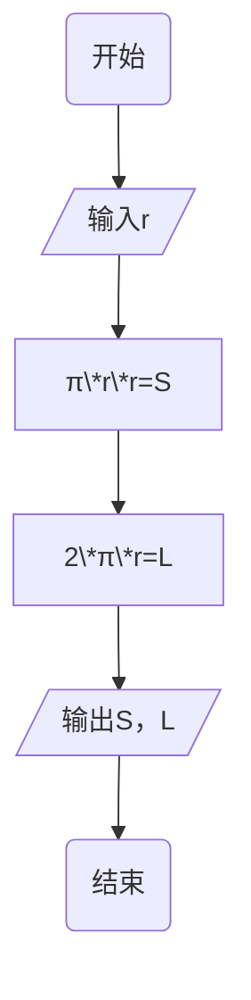
## 3.伪代码
**伪代码**是介于自然语言和编程语言之间的一种算法描述语言，如果程序比较小，可以直接使用代码描述，如：
```python
# coding:utf-8
r=eval(input('请输入圆的半径:'))
area=3.14*r*r # 面积
perimeter=2*3.14*r # 周长
print('圆的面积是:',area,'周长是:',perimeter)
```
# 二、程序的组织结构
## 1.顺序结构
**顺序结构**按程序语句的自然顺序，从上到下，依次执行每条语句的程序
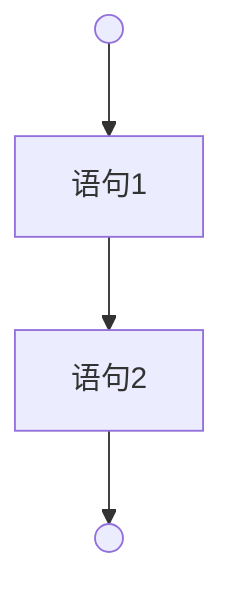
## 2.选择/分支结构
**选择结构**也称**分支结构**，是按照条件选择执行不同的代码段
### （1）单分支结构if
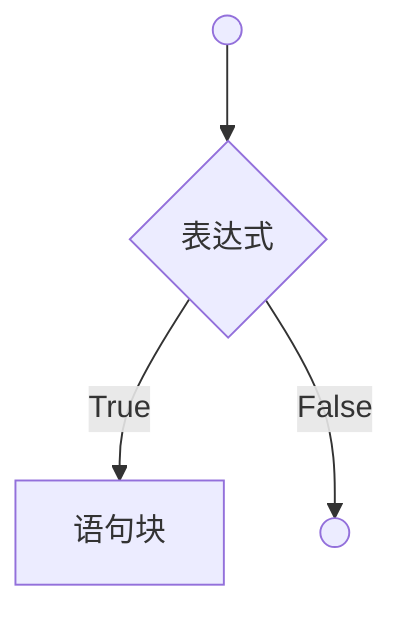
单分支结构if的语法结构：
```python
if 表达式:
	语句块
```
**执行流程**：**如果**表达式的值为True，**就**执行语句块，**如果**表达式的值为False，**就**跳过语句块，继续执行后面的代码
1. 非0的布尔值是True，当表达式的结果是非0时，也会执行语句块
2. 非空字符串的的布尔值为True，空字符串的布尔值为False，当表达式的结果是非空字符串时，也会执行语句块
3. 表达式也可以是一个单纯的布尔型变量，即输入True则执行语句块，输入False则不执行语句块
4. 使用if语句时，如果语句块中只有一句代码，可以将语句块直接写在冒号的后面
### （2）双分支结构if…else…
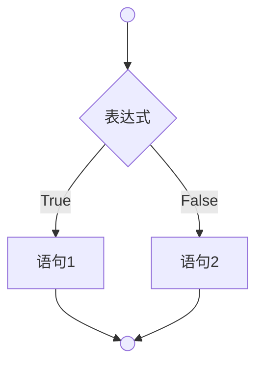
双分支结构if...else...语法结构：

```python
if 表达式:
	语句1
else:
	语句2
```
**执行流程**：**如果**表达式的值为True，**就**执行语句1，**否则就**执行语句2
```python
number=eval(input('请输入您的中奖号码:'))  
# if...else  
if number==987654:  
    print('恭喜您中奖了！')  
else:  
    print('您未中本期大奖！')  
  
print('------------以上代码可以使用条件表达式进行简化-------------')  
result='恭喜您中奖了！' if number==987654 else '您未中本期大奖！'  
print(result)  
  
print('恭喜您中奖了！' if number==987654 else '您未中本期大奖！')
```
### （3）多分支结构if…elif…elif…else…
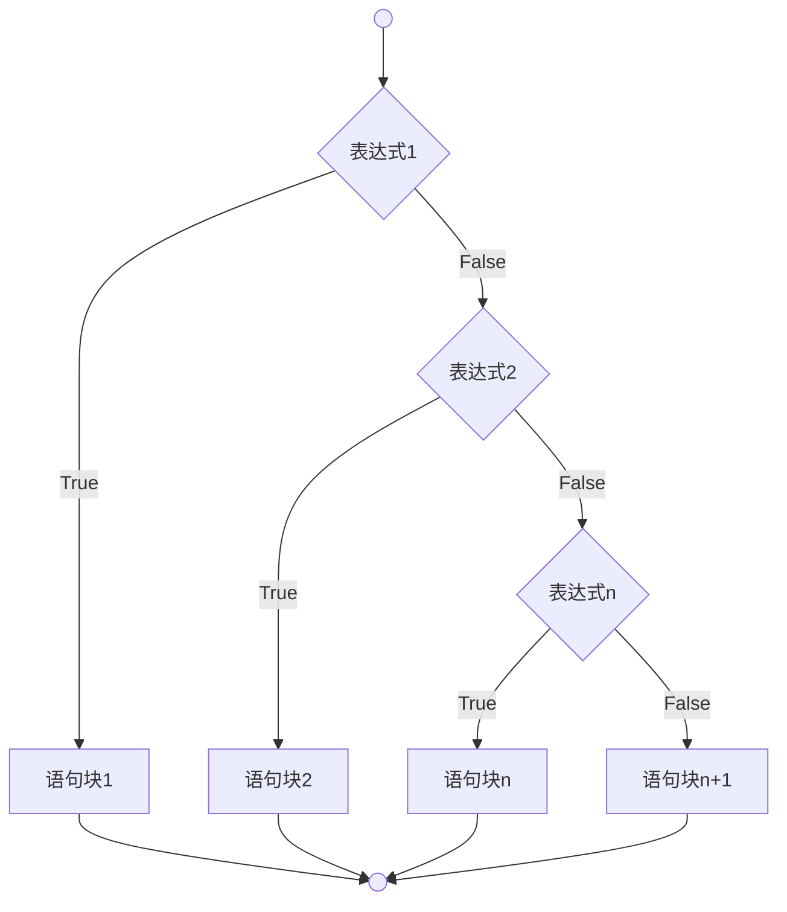
多分支结构语法结构：
```python
if 表达式1:
	语句块1
elif 表达式2:
	语句块2
elif 表达式n:
	语句块n
else:
	语句块n+1
```
在多分支结构中可以没有else结构。
### （4）嵌套if的使用
单分支结构、双分支结构和多分支结构在实际开发中是可以**互相嵌套**使用的，内层的分支结构将作为外层分支结构的语句块使用

### （5）多个条件的连接
#### ①使用and连接多个选择条件
在使用**and**连接多个条件判断时，只有**同时**满足多个条件，才能执行if后面的语句块。
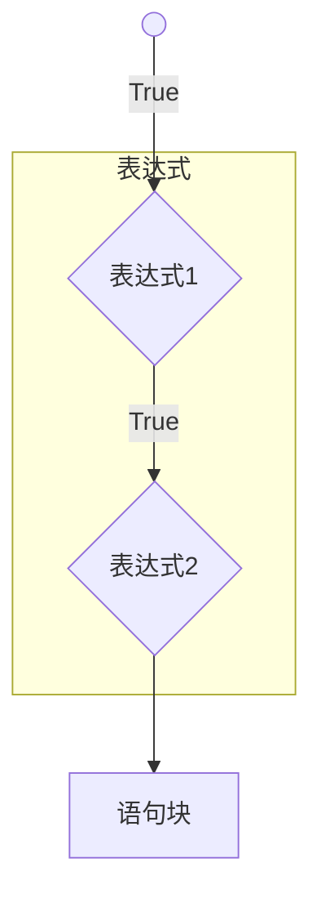
#### ②使用or连接连接多个选择条件
使用**or**连接多个判断条件时，**只要**满足多个条件中的**一个**，就可以执行if后面的语句块。
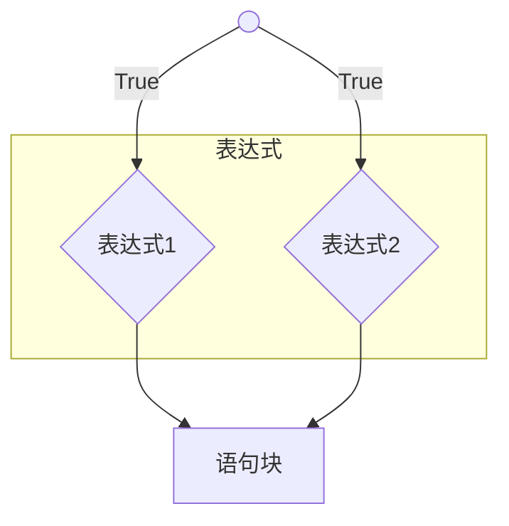
### （6）Python 3.11新特性-模式匹配match...case...
举例：
```python
score=input('请输入成绩等级:')  
match score:  
    case 'A':  
        print('优秀')  
    case 'B':  
        print('良好')  
    case 'C':  
        print('中等')  
    case 'D':  
        print('及格')  
    case 'E':  
        print('不及格')
```
输出：（若输入E）
```
请输入成绩等级:E
不及格
```
## 3.循环结构
在Python中循环结构分两类，一类是遍历循环结构**for**，一类是无限循环结构**while**。
### （1）遍历循环for
#### ①for
**遍历循环for的语句结构：**
```python
for 循环变量 in 遍历对象:
	语句块
```

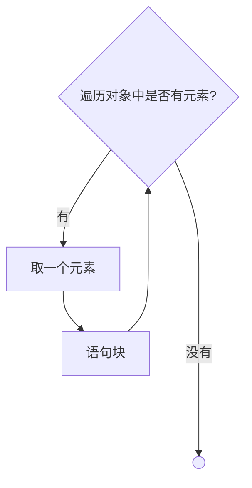
例1：遍历字符串
```python
for i in 'hello':
    print(i)
```
输出：
```
h
e
l
l
o
```
例2：**range()函数**，Python中的内置函数，产生一个\[n,m)的整数序列，包含n，但是不包含m，也可以用range(i)产生一个\[0,i)的整数数列
```python
for i in range(1,11):
    print(i)
```
输出：
```
1
2
3
4
5
6
7
8
9
10
```
```python
for i in range(3):
    print(i)
```
输出：
```
0
1
2
```
例3：
```python
for i in range(1,11):  
    if i%2==0:  
        print(i,'是偶数')
```
输出：
```
2 是偶数
4 是偶数
6 是偶数
8 是偶数
10 是偶数
```
例4：计算1-10之间的累加和
```python
s=0 # 用于存储累加和
for i in range(1,10):
    s+=i # 相当于s=s+i
print('1-10之间的累加和为:',s)
```
输出：
```
1-10之间的累加和为: 45
```
#### ②for...else...
**for...else...的语句结构：**
```python
for 循环变量 in 遍历对象:
	语句块1
else:
	语句块2
```
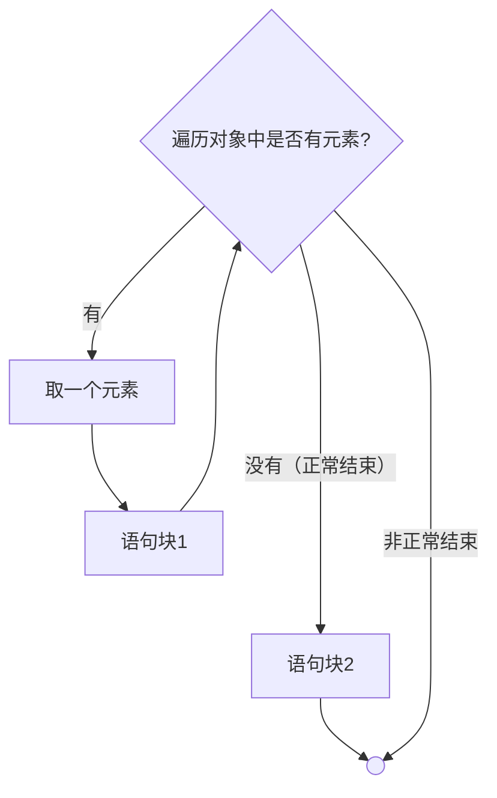
非正常结束包括break
### （2）无限循环while
#### ①while
**无限循环while的语句结构：**
```python
while 表达式:
	语句块
```
**while循环的四个步骤：**
1. 初始化变量
2. 条件判断
3. 语句块
4. 改变变量

注：在while循环当中你的初始化变量、条件判断的变量和改变的变量通常都为一个。
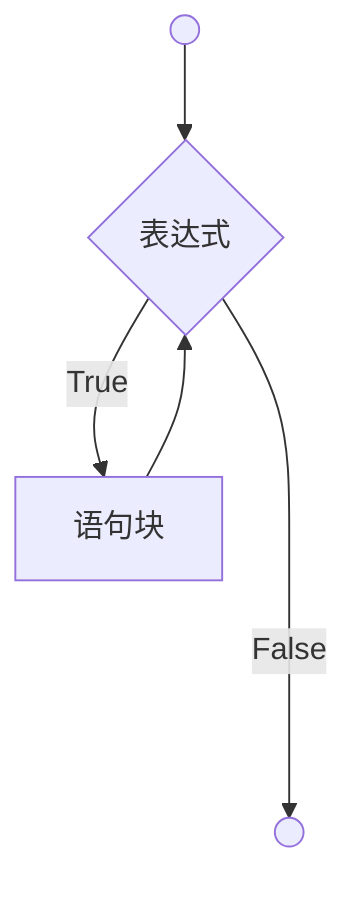
例1：
```python
answer=input('今天要上课吗?y/n')  # （1）初始化变量
while answer=='y': # （2）条件判断
    print('好好学习，天天向上') #（3）语句块
    # （4）改变变量
    answer=input('今天要上课吗?y/n')
```
例2：1-100之间的累加和
```python
s=0 # 存储累加和
i=1 # （1）初始化变量
while i<=100: # （2）条件判断
    s+=i # （3）语句块
    # （4）改变变量
    i+=1 # 相当于i=i+1
print('1-100之间的累加和:',s)
```
#### ②while...else...
**while...else...结构：**
```python
while 表达式:
	语句块1
else:
	语句块2
```
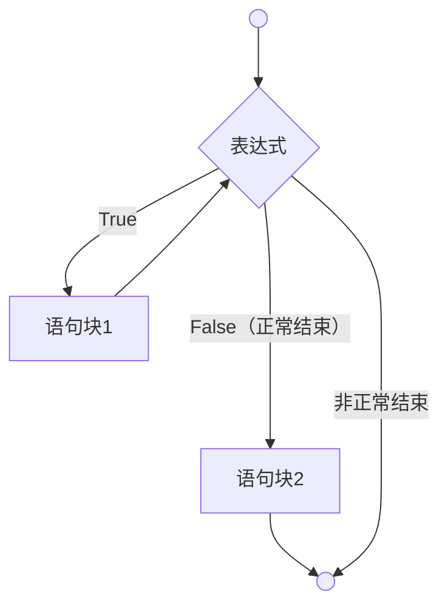
### （3）嵌套循环
**循环结构**也可以**互相嵌套**，在一个循环结构中嵌套另外一个完整的循环结构就称为嵌套循环

理论上是可以无限嵌套的，但在实际开发的过程当中，建议不要超过三层。
在嵌套循环中通常用于输出一些图形，例如长方形、三角形、菱形等

# 三、程序跳转语句
## 1.break
程序跳转语句**break**用于跳（退）出循环结构，通常与**if一起搭配**使用
### break在while循环中的使用
**语法结构：**
```python
while 表达式1:
	执行代码
	if 表达式2:
		break
```
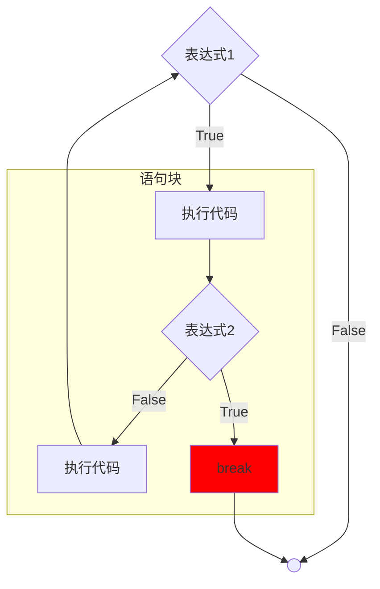
### break在for循环中的使用
**语法结构：**
```python
for 循环变量 in 遍历对象:
	执行代码
	if 表达式:
		break
```
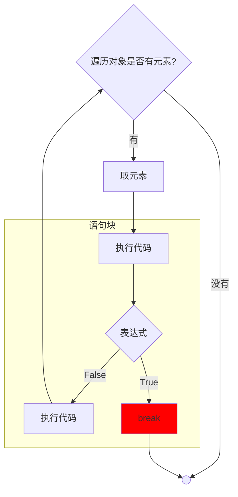
## 2.continue
**continue**的作用是用于跳过本次循环的后续代码，而继续执行下一次循环操作，continue在循环中通常也是与**if一起搭配**使用
### continue在while循环中的使用
**语法结构：**
```python
while 表达式1:
	执行代码
	if 表达式2:
		continue
```
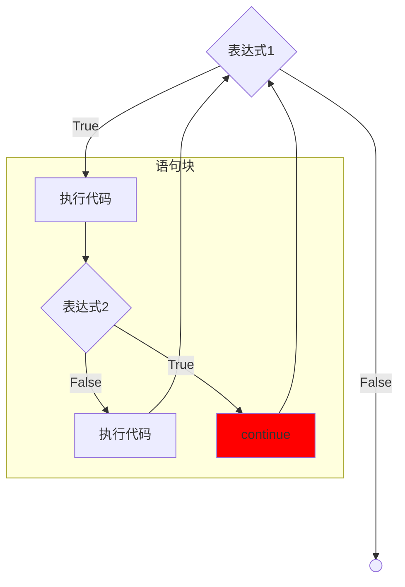
### continue在for循环中的使用
**语法结构：**
```python
for 循环变量 in 遍历对象：
	执行代码
	if 表达式：
		continue
```
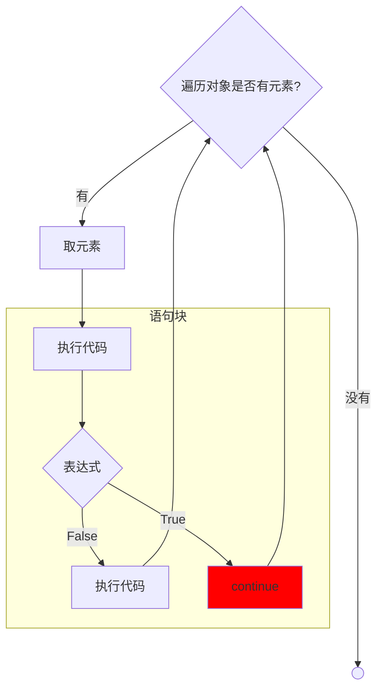
# 四、空语句pass
pass是Python中的保留字
在语法结构中只起到占位符作用，使语法结构完整，不报错
一般可用在if、for、while、函数的定义、类的定义中
# 练习
里面有产生随机数的代码：
```python
import random  
rand=random.randint(1,100) # 产生1-100之间的随机数  
count=1 # 记录猜数的次数  
while count<=10:  
    number=eval(input('在我心中有个数，1-100之间，请你猜一猜:'))  
    if number==rand:  
        print('猜对了')  
        break  
    elif number>rand:  
        print('大了')  
    else:  
        print('小了')  
    count+=1 # 每猜一次count次数要加1  
# 判断次数  
if count<=3:  
    print('真聪明，一共猜了',count,'次')  
elif count<=6:  
    print('还可以，一共猜了',count,'次')  
else:  
    print('猜的次数有点多啊，一共猜了',count,'次')
```
其中产生随机数的代码为：
```python
import random
rand=random.randint(1,100) # 产生1-100之间的随机数
```
***
# 参考文献
[1] 杨淑娟.花了2万多买的Python教程全套，现在分享给大家，入门到精通(Python全栈开发教程)\_哔哩哔哩\_bilibili\[EB/OL\].\[2025-09-14\].[花了2万多买的Python教程全套，现在分享给大家，入门到精通(Python全栈开发教程)_哔哩哔哩_bilibili](https://www.bilibili.com/video/BV1wD4y1o7AS/)