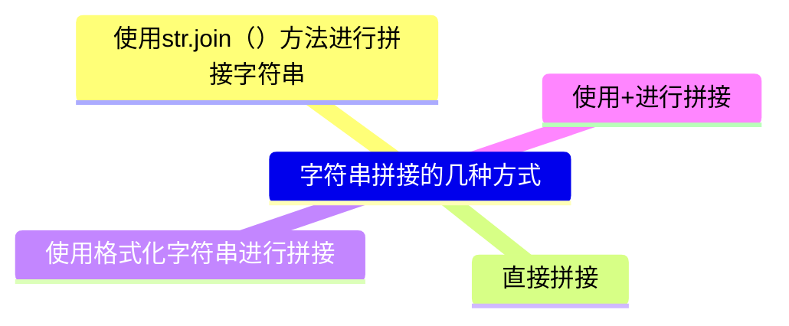

---
{"dg-publish":true,"permalink":"/Spaces/2-Areas/Python学习/第06章-字符串及正则表达式/"}
---

# 一、字符串
## 1.字符串的常用方法
字符串是Python中的**不可变**数据类型。

|方法名|描述说明|
|:-:|:-:|
|str.lower()|将str字符串全部转成小写字母，结果为一个新的字符串|
|str.upper()|将str字符串全部转成大写字母，结果为一个新的字符串|
|str.split(sep=None)|把str按照指定的分隔符sep进行分隔，结果为列表类型|
|str.count(sub)|结果为sub这个字符串在str中出现的次数|
|str.find(sub)|查询sub这个字符串在str中是否存在，如果不存在结果为-1，如果存在，结果为sub首次出现的索引|
|str.index(sub)|功能与find()相同，区别在于要查询的子串sub不存在时，程序报错|
|str.startswith(s)|查询字符串str是否以子串s开头|
|str.endswith(s)|查询字符串str是否以子串s结尾|
|str.replace(old,news)|使用news替换字符串str中所有的old字符串，结果是一个新的字符串|
|str.center(width,fillchar)|字符串str在指定的宽度范围内居中，可以使用fillchar进行填充|
|str.join(iter)|在iter中的每个元素的后面都增加一个新的字符串str|
|str.strip(chars)|从字符串中去掉左侧和右侧chars中列出的字符串|
|str.lstrip(chars)|从字符串中去掉左侧chars中列出的字符串|
|str.rstrip(chars)|从字符串中去掉右侧chars中列出的字符串|
**注意：**
1. str.replace(old,news,count)使用news替换字符串str中所有的old字符串，结果是一个新的字符串，而最后一个参数是替换次数，默认是全部替换
2. str.strip(chars)、str.lstrip(chars)、str.rstrip(chars)与顺序无关，它是去掉指定的字符，但是与顺序无关

> [!举例]-
> 举例：（此举例中没有str.join(iter)的例子，str.join(iter)的例子在”[5.数据的处理：（1）字符串的拼接操作](#（1）字符串的拼接操作)“中）
> ```python
> # 大小写转换
> s1='HelloWorld'
> new_s2=s1.lower()
> print(s1,new_s2)
> 
> new_s3=s1.upper()
> print(new_s3)
> 
> # 字符串的分割
> e_mail='ysj@126.com'
> lst=e_mail.split('@')
> print('邮箱名:',lst[0],'邮件服务器域名:',lst[1])
> 
> print(s1.count('o')) # o在字符串s1中出现了两次
> 
> # 检索操作
> print(s1.find('o')) # o在字符串s1中首次出现的位置
> print(s1.find('p')) # -1，没有找到
> 
> print(s1.index('o'))
> # print(s1.index('p')) # ValueError: substring not found 子串没有找到
> 
> # 判断前缀和后缀
> print(s1.startswith('H')) # True
> print(s1.startswith('P')) # False
> print('demo.py'.endswith('.py')) # True
> print('text.txt'.endswith('.txt')) # True
> 
> s='HelloWorld'
> # 字符串的替换
> new_s=s.replace('o','你好',1) # 最后一个参数是替换次数，默认是全部替换
> print(new_s)
> 
> # 字符串在指定的宽度范围内居中
> print(s.center(20))
> print(s.center(20,'*'))
> 
> # 去掉字符串左右的空格
> s='    Hello    World    '
> print(s.strip()) # 去除字符串左右的空格，结果是一个新的字符串
> print(s.lstrip()) # 去除字符串左侧的空格
> print(s.rstrip()) # 去除字符串右侧的空格
> 
> # 去掉指定的字符
> s3='dl-Helloworld'
> print(s3.strip('ld')) # 与顺序无关，它是去掉指定的字符，但是与顺序无关
> print(s3.lstrip('ld'))
> print(s3.rstrip('dl'))
> ```
> 输出：
> ```
> HelloWorld helloworld
> HELLOWORLD
> 邮箱名: ysj 邮件服务器域名: 126.com
> 2
> 4
> -1
> 4
> True
> False
> True
> True
> Hell你好World
>      HelloWorld     
> *****HelloWorld*****
> Hello    World
> Hello    World    
>     Hello    World
> -Hellowor
> -Helloworld
> dl-Hellowor
> ```
## 2.格式化字符串的三种方式
我们可以使用格式化字符串的方式，来简化各种数据类型之间的连接操作，换一句话来说有了格式化字符串之后，再连接各种数据类型的时候，都不会报错，常用的格式化字符串的方式有三种。
1. 占位符：
	1. %s：字符串格式
	2. %d：十进制整数格式
	3. %f：浮点数格式
2. f-string：Python3.6引入的格式化字符串的方式，比{}标明被替换的字符
3. str.format()方法：模板字符串.format（逗号分隔的参数）

举例：
```python
# （1）使用占位符进行格式化
name='马冬梅'
age=18
score=98.5
print('姓名:%s，年龄:%d，成绩:%f' % (name,age,score))
print('姓名:%s，年龄:%d，成绩:%.1f' % (name,age,score)) # %.1f中的.1代表保留小数点后1位

# （2）f-string形式
print(f'姓名:{name}，年龄:{age}，成绩:{score}')

# （3）使用字符串的format方法
print('姓名:{0}，年龄:{1}，成绩:{2}'.format(name,age,score))
print('姓名:{2}，年龄:{0}，成绩:{1}'.format(age,score,name))
```
输出：
```
姓名:马冬梅，年龄:18，成绩:98.500000
姓名:马冬梅，年龄:18，成绩:98.5
姓名:马冬梅，年龄:18，成绩:98.5
姓名:马冬梅，年龄:18，成绩:98.5
姓名:马冬梅，年龄:18，成绩:98.5
```
### 格式化字符串的详细格式

举例：
```python
s='helloworld'
print('{0:*<20}'.format(s)) # 字符串的显示宽度为20，左对齐空白部分使用*号填充
print('{0:*>20}'.format(s))
print('{0:*^20}'.format(s))

# 居中对齐
print(s.center(20,'*'))

# 千位分隔符（只适用于整数和浮点数）
print('{0:,}'.format(987654321))
print('{0:,}'.format(987654321.7865))

# 浮点数小数部分的精度
print('{0:.2f}'.format(3.1415926))
# 字符串类型，表示是最大显示长度
print('{0:.5}'.format('helloworld')) # hello

# 整数类型
a=425
print('二进制:{0:b},十进制:{0:d},八进制:{0:o},十六进制:{0:x},十六进制:{0:X}'.format(a))

# 浮点数类型
b=3.1415926
print('{0:.2f}.{0:.2E},{0:.2e},{0:.2%}'.format(b))
```
输出：
```
helloworld**********
**********helloworld
*****helloworld*****
*****helloworld*****
987,654,321
987,654,321.7865
3.14
hello
二进制:110101001,十进制:425,八进制:651,十六进制:1a9,十六进制:1A9
3.14.3.14E+00,3.14e+00,314.16%
```
## 3.字符串的编码和解码

### （1）字符串的编码
将str类型转换成bytes类型，需要使用到字符串的encode()方法（默认是utf-8）
**语法格式：**
```python
str.encode(encoding='utf-8',
	errors='strict/ignore/replace')
```
### （2）字符串的解码
将bytes类型转换成str类型，需要使用到bytes类型的decode()方法
**语法格式：**
```python
bytes.decode(encoding='utf-8',
	errors='strict/ignore/replace')
```
### 举例：
> [!举例]-
> 
> ```python
> s='伟大的中国梦'
> # 编码 str->bytesscode=s.encode(errors='replace') # 默认是utf-8，因为utf-8中文占3个字节
> print(scode)
> 
> scode_gbk=s.encode('gbk',errors='replace') # gbk中中文占2个字节
> print(scode_gbk)
> 
> # 编码中的出错问题
> s2='耶✌️​'
> scode_error=s2.encode('gbk',errors='ignore')
> print(scode_error)
> # scode_error=s2.encode('gbk',errors='strict')
> # print(scode_error) # UnicodeEncodeError: 'gbk' codec can't encode character '\u270c' in position 1: illegal multibyte sequence encoding with 'gbk' codec failed
> scode_error=s2.encode('gbk',errors='replace')
> print(scode_error) # b'\xd2\xae???'
> 
> # 解码过程bytes->str
> print(bytes.decode(scode_gbk,'gbk'))
> print(bytes.decode(scode,'utf-8'))
> ```
> 输出：
> ```
> b'\xe4\xbc\x9f\xe5\xa4\xa7\xe7\x9a\x84\xe4\xb8\xad\xe5\x9b\xbd\xe6\xa2\xa6'
> b'\xce\xb0\xb4\xf3\xb5\xc4\xd6\xd0\xb9\xfa\xc3\xce'
> b'\xd2\xae'
> b'\xd2\xae???'
> 伟大的中国梦
> 伟大的中国梦
> ```
## 4.数据的验证
数据的验证是指程序对用户输入的数据进行“**合法**”性验证

|方法名|描述说明|
|:-:|:-:|
|str.isdigit()|所有字符都是数字(阿拉伯数字)|
|str.isnumeric()|所有字符都是数字|
|str.isalpha()|所有字符都是字母(包含中文字符)|
|str.isalnum()|所有字符都是数字或字母(包含中文字符)|
|str.islower()|所有字符都是小写|
|str.isupper()|所有字符都是大写|
|str.istitle()|所有字符都是首字母大写|
|str.isspace()|所有字符都是空白字符(\n、\t等)|

> [!举例]-
> ```python
> # isdigit()十进制的阿拉伯数字
> print('123'.isdigit()) # True
> print('一二三'.isdigit()) # False
> print('0b1010'.isdigit()) # False
> print('ⅢⅢⅢ'.isdigit()) # False
> print('-'*50)
> # 所有字符都是数字
> print('123'.isnumeric()) # True
> print('一二三'.isnumeric()) # True
> print('0b1010'.isnumeric()) # False
> print('ⅢⅢⅢ'.isnumeric()) # True
> print('壹贰叁'.isnumeric()) # True
> print('-'*50)
> # 所有字符都是字母（包含中文字符）
> print('hello你好'.isalpha()) # True
> print('hello你好123'.isalpha()) # False
> print('hello你好一二三'.isalpha()) # True
> print('ⅢⅢⅢ'.isalpha()) # False
> print('hello你好壹贰叁'.isalpha()) # True
> print('-'*50)
> # 所有字符都是数字或字母
> print('hello你好'.isalnum()) # True
> print('hello你好123'.isalnum()) # True
> print('hello你好一二三'.isalnum()) # True
> print('ⅢⅢⅢ'.isalnum()) # True
> print('hello你好壹贰叁'.isalnum()) # True
> print('-'*50)
> # 判断字符的大小写
> print('HelloWorld'.islower()) # False
> print('helloworld'.islower()) # True
> print('hello你好'.islower()) # True
> print('-'*50)
> print('HelloWorld'.isupper()) # False
> print('HELLOWORLD'.isupper()) # True
> print('HELLO你好'.isupper()) # True
> print('-'*50)
> # 所有字符都是首字母大写
> print('Hello'.istitle()) # True
> print('HelloWorld'.istitle()) # False
> print('Helloworld'.istitle()) # True
> print('Hello World'.istitle()) # True
> print('Hello world'.istitle()) # False
> print('-'*50)
> # 判断是否都是空白字符
> print('\t'.isspace()) # True
> print(' '.isspace()) # True
> print('\n'.isspace()) # True
> ```

## 5.数据的处理
### （1）字符串的拼接操作

举例：
```python
s1='hello'
s2='world'
# （1）使用+进行拼接
print(s1+s2)
# （2）使用字符串的join()方法
print(''.join([s1,s2])) # 使用空字符串进行拼接
print('*'.join(['hello','world','python','java','php']))
print('你好'.join(['hello','world','python','java','php']))
# （3）直接拼接
print('hello''world')
# （4）使用格式化字符串进行拼接
print('%s%s' % (s1,s2))
print(f'{s1}{s2}')
print('{0}{1}'.format(s1,s2))
```
输出：
```
helloworld
helloworld
hello*world*python*java*php
hello你好world你好python你好java你好php
helloworld
helloworld
helloworld
helloworld
```
### （2）字符串的去重操作
```python
s='helloworldhelloworldadfdfdeoodllffe'
# （1）字符串拼接及not in
new_s=''
for item in s:
    if item not in new_s:
        new_s+=item # 拼接操作
print(new_s)

# （2）使用索引+not in
new_s2=''
for i in range(len(s)):
    if s[i] not in new_s2:
        new_s2+=s[i]
print(new_s2)

# （3）通过集合去重+列表排序
new_s3=set(s)
lst=list(new_s3)
lst.sort(key=s.index) # s.index不能加小括号，加小括号就是调用了
print(''.join(lst))
```
输出：
```
helowrdaf
helowrdaf
helowrdaf
```
# 二、正则表达式
## 1.正则表达式的简介及相关符号
### （1）元字符
具有特殊意义的专用字符，例如“^”和“$”分别表示匹配的开始和结束

|元字符|描述说明|举例|结果|
|:-:|:-:|:-:|:-:|
|.|匹配任意字符(除\n)|'p\nytho\tn'|p、 y、t、h、o、\t、 n|
|\w|匹配字母、数字、下划线|'python\n123'|p、y、t、h、o、n、1、2、 3|
|\W|匹配非字母、数字、下划线|'python\n123'|\n|
|\s|匹配任意空白字符|'python\t123'|\t|
|\S|匹配任意非空白字符|'python\t123'|p、y、t、h、o、n、1、2、3|
|\d|匹配任意十进制数|'python\t123'|1、2、3|
### （2）限定符
用于限定匹配的次数

|限定符|描述说明|举例|结果|
|:-:|:-:|:-:|:-:|
|?|匹配前面的字符0次或1次|colou?r|可以匹配color或colour|
|+|匹配前面的字符1次或多次|colou+r|可以匹配colour或colouu...r|
|*|匹配前面的字符0次或多次|colou*r|可以匹配color或colouu...r|
|{n}|匹配前面的字符n次|colou{2}r|可以匹配colouur|
|{n,}|匹配前面的字符最少n次|colou(2,}r|可以匹配colouur或colouuu...r|
|{n,m}|匹配前面的字符最小n次，最多m次|colou{2,4}r|可以匹配colouur或colouuur或colouuuur|
### （3）其它字符
|其它字符|描述说明|举例|结果|
|:-:|:-:|:-:|:-:|
|区间字符[]|匹配[]中所指定的字符|[.?!]，[0-9]|匹配标点符号点、问号、感叹号，匹配0、1、2、3、4、5、6、7、8、9|
|排除字符^|匹配不在[]中指定的字符|\[^0-9]|匹配除0、1、2、3、4、5、6、7、8、9的字符|
|选择字符\||用于匹配\|左右的任意字符|\d{18}\|\d{15}|匹配15位身份证或18位身份证|
|转义字符|同Python中的转义字符|\\.|将.作为普通字符使用|
|[\u4e00-\u9fa5]|匹配任意一个汉字|||
|分组()|改变限定符的作用|sixlfourth、(sixlfour)th|匹配six或fourth、匹配sixth或fourth|
## 2.re模块
1. Python中的内置模块
2. 用于实现Python中的正则表达式操作

|函数|功能描述|
|:-:|:-:|
|re.match(pattern,string,flags=0)|用于从字符串的开始位置进行匹配，如果起始位置匹配成功，结果为Match对象，否则结果为None。|
|re.search(pattern,string,flags=0)|用于在整个字符串中搜索第一个匹配的值，如果匹配成功，结果为Match对象，否则结果为None。|
|re.findall(pattern,string,flags=0)|用于在整个字符串搜索所有符合正则表达式的值，结果是一个列表类型。|
|re.sub (pattern,repl,string,count,flags=0)|用于实现对字符串中指定子串的替换|
|re.split(pattern,string,maxsplit,flags=0)|字符串中的split()方法功能相同，都是分隔字符串|
### （1）match函数的使用
```python
import re # 导入
pattern='\d\.\d+' # +限定符，\d 0-9数字出现1次或多次
s='I study Python 3.11 every day' # 待匹配字符串
match=re.match(pattern,s,re.I) # re.I中的I指ignore，忽略大小写
print(match) # None
s2='3.11Python I study every day'
match2=re.match(pattern,s2)
print(match2) # <re.Match object; span=(0, 4), match='3.11'>

print('匹配值的起始位置:',match2.start())
print('匹配值的结束位置:',match2.end())
print('匹配区间的位置元素:',match2.span())
print('待匹配的元素:',match2.string)
print('匹配的数据:',match2.group())
```
输出：
```
None
<re.Match object; span=(0, 4), match='3.11'>
匹配值的起始位置: 0
匹配值的结束位置: 4
匹配区间的位置元素: (0, 4)
待匹配的元素: 3.11Python I study every day
匹配的数据: 3.11
```
### （2）search函数的使用
```python
import re
pattern='\d\.\d+'
s='I study Python3.11 every day Python2.7 I love you'
match=re.search(pattern,s)

s2='3.10 Python I study every day'
s3='Python I study every day'
match2=re.search(pattern,s2)
match3=re.search(pattern,s3) # None
print(match)
print(match2)
print(match3)

print(match.group())
print(match2.group())
```
输出：
```
<re.Match object; span=(14, 18), match='3.11'>
<re.Match object; span=(0, 4), match='3.10'>
None
3.11
3.10
```
### （3）findall函数的使用
注意：finall输出结果是一个列表类型。
> [!举例]-
> ```python
> import re # 导入
> pattern='\d\.\d+' # +限定符，\d 0-9数字出现1次或多次
> s='I study Python3.11 every day Python2.7 I love you'
> s2='3.10 Python I study every day'
> s3='Python I study every day'
> lst=re.findall(pattern,s)
> lst2=re.findall(pattern,s2)
> lst3=re.findall(pattern,s3)
> print(lst)
> print(lst2)
> print(lst3)
> ```
> 输出：
> ```
> ['3.11', '2.7']
> ['3.10']
> []
> ```
### （4）sub函数的使用
> [!举例]-
> ```python
> import re
> pattern='黑客|破解|反爬'
> s='我想学习Python，想破解一些VIP视频，Python可以实现无底线反爬吗？'
> new_s=re.sub(pattern,'XXX',s)
> print(new_s)
> ```
> 输出：
> ```
> 我想学习Python，想XXX一些VIP视频，Python可以实现无底线XXX吗？
> ```
### （5）split函数的使用
> [!举例]-
> ```python
> s2='https://www.baidu.com/s?wd=ysj&rsv_spt=1'
> pattern2='[?|&]'
> lst=re.split(pattern2,s2)
> print(lst)
> ```
> 输出：
> ```
> ['https://www.baidu.com/s', 'wd=ysj', 'rsv_spt=1']
> ```
# 章节习题
1. Python程序采用Unicode编码，英英文字符和中文字符在Python中分别对应字符的个数是：（ ）
A．1个字节和3个字节
B．1个字节和1个字节
C．1个字节和2个字节
D．1个字符和1个字符

> [!答案]-
> 答案：D
> 解析：
> 分别对应的字符的个数都是1；如果是字节数，则英文一个是占一个字节，中文在utf-8是占3个字节

2. 以下代码的运行结果是：（ ）
```python
word='三更灯火五更鸡，正是男儿读书时'
print(word.index('正是男儿读书时'))
print(word.find('黑发不知勤学早'))
print(word.index('白首方悔读书迟'))
```
A．8,-1,报错
B．9,0,报错
C．[8,9,10,11,12,13,14],-1,-1
D．报错
> [!答案]-
> 答案：A
> 解析：
> 应该是起始索引，并不是整个的全部的索引。

3. 以下代码的运行结果是：（）
```python
import re
pattern=r'\s*@'
s='@杨淑娟 @刘梅梅 @郭小川'
lst=re.split(pattern,s)
print(lst)
```
A．['','杨淑娟','刘梅梅','郭小川'］
B．['杨淑娟','刘梅梅','郭小川']
C．['@杨淑娟','@刘梅梅','@郭小川']
D．[]
> [!答案]-
> 答案：A
> 解析：
> 第一个@前还有空的东西，所以从第一个@开始劈分，也就是说三个@符号它会劈分出四个结果来。
***
# 参考文献
[1] 杨淑娟.花了2万多买的Python教程全套，现在分享给大家，入门到精通(Python全栈开发教程)\_哔哩哔哩\_bilibili\[EB/OL\].\[2025-09-14\].[花了2万多买的Python教程全套，现在分享给大家，入门到精通(Python全栈开发教程)_哔哩哔哩_bilibili](https://www.bilibili.com/video/BV1wD4y1o7AS/)