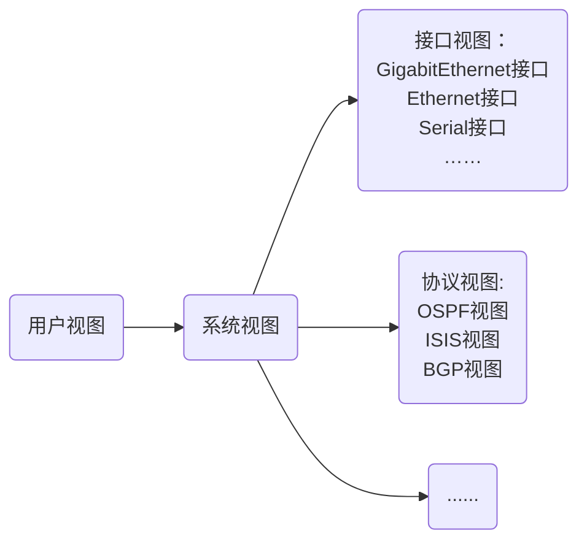

---
{"dg-publish":true,"dg-path":"网络/网络学习/004-命令行操作基础.md","permalink":"/网络/网络学习/004-命令行操作基础/"}
---

# 一、配置网络设备的方法
## 1.访问网络设备命令行接口的方法
- 通过Console（控制台）口本地访问  
- 通过AUX（辅助）口远程访问
- 使用Telnet（远程登录）终端访问
- 使用SSH（安全壳）终端访问
- 通过异步串口（专门的硬件）访问
## 2.通过Console口登录设备

查看本机端口参数：

设置连接端口和通信参数：


|参数|取值|
|:-:|:-:|
|每秒位数（波特率）|9600|
|数据位|8|
|奇偶校验|无|
|停止位|1|
|数据流控制（流量控制）|无|

初次登陆AC时要初始化console密码,密码要输入两次，并且保持一样。
这里配置的密码不会显示出来。
```
Press any key to get started

Please configure the login password (maximum length 16)
Enter password:
Confirm password:
<Huawei>
```
## 3.使用AUX口进行连接

## 4.使用Telnet进行连接
- 使用TCP端口23


配置登录案例见[[Spaces/2-Areas/网络/网络实验案例/001-远程登录案例#一、Telnet\|001-远程登录案例]]
## 5.使用SSH进行连接
- SSH（Secure Shell，安全外壳）在无安全保证的网络上提供安全的远程登录等服务
- 由传输协议、验证协议和连接协议三部分组成
- 使用TCP端口22
- 提供Password和Publickey两种验证方式


配置登录案例见[[Spaces/2-Areas/网络/网络实验案例/001-远程登录案例#二、SSH\|001-远程登录案例]]
# 二、VRP基础
**VRP：Versatile Routing Platform，通用路由平台。**
## 1.文件系统
- 文件系统是指对存储器中文件、目录的管理，功能包括查看、创建、重命名和删除目录，拷贝、移动、重命名和删除文件等。
- 掌握文件系统的基本操作，对于网络工程师高效管理设备的配置文件和VRP系统文件至关重要。

<big>**常见文件类型**：</big>
- **系统软件**
	- 系统软件是设备启动、运行的必备软件，为整个设备提供支撑、管理、业务等功能。常见文件后缀名为：（.cc）。
- **配置文件**
	- 配置文件是用户将配置命令保存的文件，作用是允许设备以指定的配置启动生效。常见文件后缀名为：(.cfg, .zip , .dat)。
- **补丁文件**
	- 补丁是一种与设备系统软件兼容的软件，用于解决设备系统软件少量且急需解决的问题。常见文件后缀名为：(.pat)。
- **PAF文件**
	- PAF文件是根据用户对产品需要提供了一个简单有效的方式来裁剪产品的资源占用和功能特性。常见文件后缀名为：(.bin)。
## 2.存储设备
存储设备包括：SDRAM、Flash、NVRAM 、SD Card、USB。
- **SDRAM**：同步动态随机存储器是系统运行内存,相当于电脑的内存。
- **Flash**：属于非易失存储器，断电后，不会丢失数据。主要存放系统软件，配置文件等；补丁文件和PAF文件由维护人员上传，一般存储于flash或SD Card中。
- **NVRAM**：非易失随机读写存储器，用于存储日志缓存文件，定时器超时或缓存满后再写入Flash。
- **SD Card**：断电后，不会丢失数据。存储容量较大，一般出现在主控板上，可以存放系统文件，配置文件，日志等。
- **USB**：USB是接口，用于外接大容量存储设备，主要用于设备升级，传输数据。
## 3.设备初始化过程
设备上电后，首先运行BootROM软件，初始化硬件并显示设备的硬件参数，然后运行系统软件，最后从默认存储路径中读取配置文件进行设备的初始化操作。

## 4.设备管理
用户对设备的常见管理方式主要有**命令行**方式和**Web网管**方式两种。
用户需要通过相应的方式登录到设备后才能对设备进行管理。
## 5.用户界面
用户通过命令行方式登录设备时，系统会分配一个用户界面用来管理、监控设备和用户间的当前会话。
设备系统支持的用户界面有**Console用户界面**和**虚拟类型终端VTY（Virtual Type Terminal）用户界面**。
## 6.用户级别
提供基本的权限控制，可以实现不同级别的用户能够执行不同级别的命令，用以限制不同用户对设备的操作

|用户等级|命令等级|名称|说明|
|:-:|:-:|:-:|:-:|
|0|0|参观级|可使用网络诊断工具命令（ping、tracert）、从本设备出发访问外部设备的命令（Telnet客户端命令）、部分display命令等。|
|1|0 and 1|监控级|用于系统维护，可使用display等命令。|
|2|0,1 and 2|配置级|可使用业务配置命令，包括路由、各个网络层次的命令，向用户提供直接网络服务。|
|3-15|0,1,2 and 3|管理级|可使用用于系统基本运行的命令，对业务提供支撑作用，包括文件系统、FTP、TFTP下载、命令级别设置命令以及用于业务故障诊断的debugging命令等。|

## 7.WEB网管方式登录
以华为AR系列路由器为例，PC终端打开浏览器软件，在地址栏中输入“https://192.168.1.1”，按下回车键，显示AR Web管理平台登录界面。
## 8.命令行方式
### （1）本地登录
设备登录方式分为两种：本地登录和远程登录。其中本地登录包括：
- 当用户需为第一次上电的设备进行配置时，可通过Console口本地登录设备。
- 控制口（Console Port）是一种通信串行端口，由设备的主控板提供。
- 用户终端的串行端口可以与设备Console口直接连接，然后通过PUTTY工具本地登录实现对设备的本地配置。

PUTTY工具是一个Telnet、SSH、串行接口等的连接软件。
### （2）远程登录
远程登录允许终端远程登录到任何可以充当远程登录服务器的设备，对这些网络设备进行集中的管理和维护。远程登录方法包括：Telnet和SSH。
- 如果通过SSH远程登录，连接类型为“SSH”，需要输入远程登录服务器的IP地址，端口号缺省为22。
- 如果通过Telnet远程登录，连接类型为“Telnet”，需要输入远程登录服务器的IP地址，端口号缺省为23。

登录成功后即进入命令行界面CLI（Command Line Interface）。
命令行界面是工程师与网络设备进行交互的常用工具。
# 三、命令行基础
## 1.基本命令结构
命令按照一定的格式设计，用户可以通过命令行界面输入命令，由命令行界面对命令进行解析，实现用户对路由器的配置和管理。

- **命令字**：规定了系统应该执行的功能，如display（查询设备状态），reboot（重启设备）等命令字。
- **关键字**：特殊的字符构成，用于进一步约束命令，是对命令的拓展，也可用于表达命令构成逻辑而增设的补充字符串。
- **参数列表**：是对命令执行功能的进一步约束。包括一对或多对参数名和参数值。
## 2.命令行视图
设备提供了多样的配置和查询命令，为便于用户使用这些命令，VRP系统按功能分类将命令分别注册在不同的命令行视图下。

- 用户视图：用户可以完成查看运行状态和统计信息等功能。
- 系统视图：用户可以配置系统参数以及通过该视图进入其他的功能配置视图。
- 其他视图：比如接口视图，协议视图，用户可以进行接口参数和协议参数配置。


```
命令行举例：  
<Huawei>system-view                                  #用户首先进入用户视图，通过命令进入系统视图
[Huawei]interface GigabitEthernet 0/0/1    		       #在系统视图进入接口视图	
[Huawei-GigabitEthernet0/0/1]ip address 192.168.1.1 24 #配置IP地址
[Huawei-GigabitEthernet0/0/1]quit    		     	   #退回到上一个视图	
[Huawei]ospf 1                           			   #在系统视图进入协议视图	
[Huawei-ospf-1]area 0                			       #在协议视图进入OSPF区域视图
[Huawei-ospf-1-area-0.0.0.0]return     		 	       #返回用户视图
```
登录到系统后，首先进入的是用户视图，这里仅提供查询，以及ping，telnet等工具命令，不提供任何配置命令。
## 3.编辑命令行
1. 功能键
	- 退格键Backspace：删除光标位置的前一个字符，光标左移，若已经到达命令首，则响铃告警。
	- 左光标键←或<Ctrl+B>：光标向左移动一个字符位置，若已经到达命令首，则响铃告警。
	- 右光标键→或<Ctrl+F>：光标向右移动一个字符位置，若已经到达命令尾，则响铃告警。
2. 不完整关键字输入
	- 设备支持不完整关键字输入，即在当前视图下，当输入的字符能够匹配唯一的关键字时，可以不必输入完整的关键字
	- 注：此处的关键字与命令行格式中的“关键字”不同，一条命令中除“参数值”外都可以被叫做关键字。
3. <kbd>Tab</kbd>键的使用
	- 如果与之匹配的关键字唯一，按下<kbd>Tab</kbd>键，系统自动补全关键字，不全后，反复按<kbd>Tab</kbd>关键字不变。
	- 如果与之匹配的关键字不唯一，反复按<kbd>Tab</kbd>键可循环显示所有以输入字符串开头的关键字。
	- 如果没有与之匹配的关键字，按<kbd>Tab</kbd>键后，关键字不变。

## 4.使用命令行在线帮助
命令行在线帮助可分为完全帮助和部分帮助，可通过输入“？”实现。

完全帮助：
```
<Huawei> ?
User view commands:
arp-ping       ARP-ping
autosave       <Group> autosave command group
backup         Backup  information
cd             Change current directory
clear          Clear
clock          Specify the system clock
...
```
部分帮助：
```
<Huawei> d?
debugging  <Group> debugging command group
delete     Delete a file
dialer     Dialer
dir        List files on a filesystem
display    Display information 
```
## 5.解读命令行的错误信息
用户键入的命令，如果通过语法检查，则正确执行，否则系统将会向用户报告错误信息。

## 6.使用undo命令行
在命令前加undo关键字，即为undo命令行，也就是不加undo时的反义词。undo命令行一般用来恢复缺省情况、禁用某个功能或者删除某项配置。

使用undo命令行恢复缺省情况
```
<Huawei> system-view
[Huawei] sysname Server
[Server] undo sysname
[Huawei]
```
使用undo命令禁用某个功能
```
<Huawei> system-view
[Huawei] ftp server enable 
[Huawei] undo ftp server
```
使用undo命令删除某项设置
```
[Huawei]interface g0/0/1
[Huawei-GigabitEthernet0/0/1]ip address 192.168.1.1 24
[Huawei-GigabitEthernet0/0/1]undo ip address
```
## 7.使用命令行的快捷键
系统中的快捷键分成两类，自定义快捷键和系统快捷键。
### （1）自定义快捷键
自定义快捷键：共有4个，<kbd>Ctrl</kbd>+<kbd>G</kbd>、<kbd>Ctrl</kbd>+<kbd>L</kbd>、<kbd>Ctrl</kbd>+<kbd>O</kbd>和<kbd>Ctrl</kbd>+<kbd>U</kbd>。
用户可以根据自己的需要将这4个快捷键与任意命令进行关联，当使用快捷键时，系统自动执行它所对应的命令。
```
<Huawei> system-view
[Huawei] hotkey ctrl_l "display tcp status"
```
### （2）系统快捷键
- <kbd>Ctrl</kbd>+<kbd>A</kbd>：将光标移动到当前行的开头
- <kbd>Ctrl</kbd>+<kbd>B</kbd>：将光标向左移动一个字符
- <kbd>Ctrl</kbd>+<kbd>C</kbd>：停止当前命令的运行
- <kbd>Ctrl</kbd>+<kbd>E</kbd>：将光标移动到当前行的末尾
- <kbd>Ctrl</kbd>+<kbd>X</kbd>：删除光标左侧所有的字符
- <kbd>Ctrl</kbd>+<kbd>Y</kbd>：删除光标所在位置及其右侧所有的字符
- <kbd>Ctrl</kbd>+<kbd>Z</kbd>：返回到用户视图
- <kbd>Ctrl</kbd>+<kbd>]</kbd> ：终止当前连接或切换连接
## 8.分页显示
- <kbd>Space</kbd>：继续显示下一屏信息
- <kbd>Enter</kbd>：继续显示下一行信息
- <kbd>Ctrl</kbd>+<kbd>C</kbd> ：停止显示和命令执行
## 9.命令行历史记录功能
查看历史命令记录

<font class="code">\<Huawei\> **display history-command**</font>

- 翻阅和调出历史记录中的某一条命令
	- 用<kbd>↑</kbd>或<kbd>Ctrl</kbd>+<kbd>P</kbd>快捷键调出上一条历史命令
	- 用<kbd>↓</kbd>或<kbd>Ctrl</kbd>+<kbd>N</kbd>快捷键调出下一条历史命令

# 四、基本配置命令（华为、华三）
## 1.常见文件系统操作命令
1. 查看当前目录

<font class="code">\<Huawei\> **pwd**</font>

2. 显示当前目录下的文件信息

<font class="code">\<Huawei\> **dir** [ **/all** ] [ filename | directory ]</font>

在用户视图中使用**dir**命令，可以查看flash中的文件信息。

3. 查看文本文件的具体内容

<font class="code">\<Huawei\> **more** [ **/binary** ] filename [ offset ] [ **all** ]</font>

4. 修改用户当前界面的工作目录

<font class="code">\<Huawei\> **cd** *directory*</font>

5. 创建新的目录

<font class="code">\<Huawei\> **mkdir** *directory*</font>

目录名称可以包含1-64个字符。

6. 删除目录

<font class="code">\<Huawei\> **rmdir** *directory*</font>

此处需要注意的是，只有空目录才能被删除。

7. 复制文件

<font class="code">\<Huawei\> **copy** *source-filename destination-filename*</font>

如果目标文件已存在，系统会提示此文件将被替换。目标文件名不能与系统启动文件同名，否则系统将会出现错误提示。

8. 移动文件

<font class="code">\<Huawei\> **move** *source-filename destination-filename*</font>

move命令只适用于在同一储存设备中移动文件。

9. 重命名文件

<font class="code">\<Huawei\> **rename** *old-name new-name*</font>

10. 删除文件

<font class="code">\<Huawei\> **delete** [ **/unreserved** ] [ **/force** ] { *filename* | *devicename* }</font>

不带**unreserved**参数的情况下，被删除的文件将直接被移动到回收站。回收站中的文件也可以通过执行**undelete**命令进行恢复，但是如果执行**delete**命令时指定了**unreserved**参数，则文件将被永久删除。在删除文件时，系统会提示“是否确定删除文件”，但如果命令中指定了**/force** 参数，系统将不会给出任何提示信息。*filename*参数指的是需要删除的文件的名称，*devicename*参数指定了储存设备的名称。

11. 恢复删除的文件

<font class="code">\<Huawei\> **undelete**</font>

12. 彻底删除回收站中的文件

<font class="code">\<Huawei\> **reset recycle-bin** [ *filename* | *devicename* ]</font>

*filename*参数指定了需要永久删除的文件的名称，*device-name*参数指定了储存设备的名称。
## 2.基本配置命令
1. 配置设备名称

<font class="code">[Huawei] **sysname** *name*</font>

2. 设置系统时钟

<font class="code">\<Huawei\> **clock timezone** *time-zone-name* { **add** | **minus** } *offset*</font>

3. 用来对本地时区信息进行设置

<font class="code">\<Huawei\> **clock datetime** [ **utc** ] *HH:MM:SS YYYY-MM-DD*</font>

4. 用来设置设备当前或UTC日期和时间。

<font class="code">\<Huawei\> **clock daylight-saving-time**</font>

5. 配置命令等级

<font class="code">[Huawei] **command-privilege level** *level* **view** *view-name command-key*</font>

用来设置指定视图内的命令的级别。命令级别分为参观、监控、配置、管理4个级别，分别对应标识0、1、2、3。

6. 配置用户通过Password方式登录设备

<font class="code">[Huawei] **user-interface vty 0 4**
[Huawei-ui-vty0-4] **set authentication password cipher** *information*</font>

用来进入指定的用户视图并配置用户认证方式为password。系统支持的用户界面包括Console用户界面和VTY用户界面，Console界面用于本地登录，VTY界面用于远程登录。默认情况下，设备一般最多支持15个用户同时通过VTY方式访问。

7. 配置用户界面参数

<font class="code">[Huawei] **idle-timeout** *minutes* [ *seconds* ]</font>

用来设置用户界面断开连接的超时时间。如果用户在一段时间内没有输入命令，系统将断开连接。缺省情况下，超时时间是10分钟。

8. 配置接口IP地址

<font class="code">[Huawei] **interface** *interface-number*
[Huawei-*interface-number*] **ip address** *ip-address* { *mask* | *mask-length* }</font>

用来给设备上的物理或逻辑接口配置IP地址。
要在接口运行IP服务，必须为接口配置一个IP地址。一个接口一般只需要一个IP地址,如果接口配置了新的主IP地址，那么新的主IP地址就替代了原来的主IP地址。
用户可以利用**ip address** *ip-address*  { *mask* | *mask-length* } 命令为接口配置IP地址，这个命令中，mask代表子网掩码，如255.255.255.0，mask-length 代表的是掩码长度，如24。这两者任取其一均可。
Loopback接口是一个逻辑接口，可用来虚拟一个网络或者一个IP主机。在运行多种协议的时候，由于Loopback接口稳定可靠，所以也可以用来做管理接口。
在给物理接口配置IP地址时，需要关注该接口的物理状态。默认情况下，华为路由器和交换机的接口状态为up；如果该接口曾被手动关闭，则在配置完IP地址后，应使用**undo shutdown**打开该接口。

9. 查看当前运行的配置文件

<font class="code">\<Huawei\> **display current-configuration**</font>

10. 配置文件保存

<font class="code">\<Huawei\> **save**</font>

11. 查看保存的配置

<font class="code">\<Huawei\> **display saved-configuration**</font>

12. 清除已保存的配置

<font class="code">\<Huawei\> **reset saved-configuration**</font>

用来清除配置文件或配置文件中的内容。执行该命令后，如果不使用命令**startup saved-configuration**重新指定设备下次启动时使用的配置文件，也不使用**save**命令保存当前配置，则设备下次启动时会采用缺省的配置参数进行初始化。

13. 查看系统启动配置参数

<font class="code">\<Huawei\> **display startup**</font>

用来查看设备本次及下次启动相关的系统软件、备份系统软件、配置文件、License文件、补丁文件以及语音文件。

14. 配置系统下次启动时使用的配置文件

<font class="code">\<Huawei\> **startup saved-configuration** *configuration-file*</font>

设备升级时，可以通过此命令让设备下次启动时加载指定的配置文件，*configuration-file*参数为系统启动配置文件的名称。

15. 配置设备重启

<font class="code">\<Huawei\> **reboot**</font>

用来重启设备，重启前提示用户是否保存配置。

16. 配置欢迎/提示信息

<font class="code">[Huawei] **header** ?
  login 指定登录身份验证标志
  shell 指定会话标题</font>

17. 查看版本信息

<font class="code">\<Huawei\> **display version**</font>

18. 显示接口信息（调试排错）

<font class="code">\<Huawei\> **display interface**</font>

19. 显示接口IP状态与配置信息

<font class="code">\<Huawei\> **display ip interface brief**</font>

20. 显示系统运行统计信息，运行时占用系统特别多

<font class="code">\<Huawei\> **display diagnostic-information**</font>

## 3.使用常用命令进行设备调试
### （1）ping命令
ping命令：
- -a	指定源ip地址(为了测试新的网段）
- -c	指定发送ping包的次数
- -r	给出路由功能（测试数据所走的路径）
- -s	指定有效载荷（56字节，可以大于小于56字节，最大不能超过9600）
- -t	指定超时时间
### （2）tracert命令
tracert的实现原理跟踪ip数据包在网络中所走路径。
由trcert建立一个UDP数据包,并且是一个高端口的值，一般大于30000。不断修改TTL值并发送出去，如果收到"超时错"，表示刚刚到达的是路由器，而如果收到的是"端口不可达"错误，表示刚刚到达的就是目的主机。这样路由跟踪完成，程序结束。
<style> .container {font-family: sans-serif; text-align: center;} .button-wrapper button {z-index: 1;height: 40px; width: 100px; margin: 10px;padding: 5px;} .excalidraw .App-menu_top .buttonList { display: flex;} .excalidraw-wrapper { height: 800px; margin: 50px; position: relative;} :root[dir="ltr"] .excalidraw .layer-ui__wrapper .zen-mode-transition.App-menu_bottom--transition-left {transform: none;} </style><script src="https://cdn.jsdelivr.net/npm/react@17/umd/react.production.min.js"></script><script src="https://cdn.jsdelivr.net/npm/react-dom@17/umd/react-dom.production.min.js"></script><script type="text/javascript" src="https://cdn.jsdelivr.net/npm/@excalidraw/excalidraw@0/dist/excalidraw.production.min.js"></script><div id="excalidraw-001-命令行操作基础&002-文件传输案例-1excalidraw.md1"></div><script>(function(){const InitialData={"type":"excalidraw","version":2,"source":"https://github.com/zsviczian/obsidian-excalidraw-plugin/releases/tag/2.15.3","elements":[{"id":"6QNO2qnm5ltZ6LhUBKUBN","type":"line","x":-340.25,"y":-146.875,"width":616,"height":1.5,"angle":0,"strokeColor":"#1e1e1e","backgroundColor":"transparent","fillStyle":"solid","strokeWidth":2,"strokeStyle":"solid","roughness":0,"opacity":100,"groupIds":[],"frameId":null,"index":"a4","roundness":{"type":2},"seed":567776777,"version":123,"versionNonce":636678281,"isDeleted":false,"boundElements":null,"updated":1758284833075,"link":null,"locked":false,"points":[[0,0],[616,1.5]],"lastCommittedPoint":null,"startBinding":null,"endBinding":null,"startArrowhead":null,"endArrowhead":null,"polygon":false},{"id":"eNWmYeQPQUZXz-VJwxbLQ","type":"image","x":-263.25,"y":-176.71759259259258,"width":70,"height":57.68518518518518,"angle":0,"strokeColor":"transparent","backgroundColor":"transparent","fillStyle":"solid","strokeWidth":2,"strokeStyle":"solid","roughness":1,"opacity":100,"groupIds":[],"frameId":null,"index":"a5","roundness":null,"seed":373147817,"version":218,"versionNonce":1429977511,"isDeleted":false,"boundElements":[],"updated":1758284368923,"link":null,"locked":false,"status":"pending","fileId":"6c703edecb4ca756d27f7772455f0ed845f19131","scale":[1,1],"crop":null},{"id":"riwSiRSv02kRPjGQu5Qh8","type":"image","x":-63.75,"y":-175.21759259259258,"width":70,"height":57.68518518518518,"angle":0,"strokeColor":"transparent","backgroundColor":"transparent","fillStyle":"solid","strokeWidth":2,"strokeStyle":"solid","roughness":1,"opacity":100,"groupIds":[],"frameId":null,"index":"a6","roundness":null,"seed":1668327495,"version":129,"versionNonce":2025019465,"isDeleted":false,"boundElements":[],"updated":1758284368923,"link":null,"locked":false,"status":"pending","fileId":"6c703edecb4ca756d27f7772455f0ed845f19131","scale":[1,1],"crop":null},{"id":"6zEps4pRzQUhUPN3Vx4fJ","type":"image","x":128.75,"y":-176.71759259259258,"width":70,"height":57.68518518518518,"angle":0,"strokeColor":"transparent","backgroundColor":"transparent","fillStyle":"solid","strokeWidth":2,"strokeStyle":"solid","roughness":1,"opacity":100,"groupIds":[],"frameId":null,"index":"a7","roundness":null,"seed":1520719303,"version":135,"versionNonce":553905351,"isDeleted":false,"boundElements":[],"updated":1758284368923,"link":null,"locked":false,"status":"pending","fileId":"6c703edecb4ca756d27f7772455f0ed845f19131","scale":[1,1],"crop":null},{"id":"yTJtC2LM","type":"text","x":-227.25,"y":-114.375,"width":70.38711547851562,"height":15.999999999999995,"angle":0,"strokeColor":"#1e1e1e","backgroundColor":"transparent","fillStyle":"solid","strokeWidth":2,"strokeStyle":"solid","roughness":1,"opacity":100,"groupIds":[],"frameId":null,"index":"a8","roundness":null,"seed":1540647881,"version":94,"versionNonce":855858183,"isDeleted":false,"boundElements":null,"updated":1758284432378,"link":null,"locked":false,"text":"192.168.1.1","rawText":"192.168.1.1","fontSize":12.799999999999995,"fontFamily":6,"textAlign":"left","verticalAlign":"top","containerId":null,"originalText":"192.168.1.1","autoResize":true,"lineHeight":1.25},{"id":"9oXTlgwU","type":"text","x":-116.94356689453127,"y":-113.375,"width":70.38711547851562,"height":15.999999999999995,"angle":0,"strokeColor":"#1e1e1e","backgroundColor":"transparent","fillStyle":"solid","strokeWidth":2,"strokeStyle":"solid","roughness":1,"opacity":100,"groupIds":[],"frameId":null,"index":"a9","roundness":null,"seed":361746281,"version":130,"versionNonce":2090829993,"isDeleted":false,"boundElements":[],"updated":1758284445128,"link":null,"locked":false,"text":"192.168.1.2","rawText":"192.168.1.2","fontSize":12.799999999999995,"fontFamily":6,"textAlign":"left","verticalAlign":"top","containerId":null,"originalText":"192.168.1.2","autoResize":true,"lineHeight":1.25},{"id":"TFqNIukQ","type":"text","x":-14.443557739257812,"y":-113.375,"width":70.38711547851562,"height":15.999999999999995,"angle":0,"strokeColor":"#1e1e1e","backgroundColor":"transparent","fillStyle":"solid","strokeWidth":2,"strokeStyle":"solid","roughness":1,"opacity":100,"groupIds":[],"frameId":null,"index":"aA","roundness":null,"seed":1475221447,"version":175,"versionNonce":341047687,"isDeleted":false,"boundElements":[],"updated":1758284482162,"link":null,"locked":false,"text":"192.168.2.1","rawText":"192.168.2.1","fontSize":12.799999999999995,"fontFamily":6,"textAlign":"left","verticalAlign":"top","containerId":null,"originalText":"192.168.2.1","autoResize":true,"lineHeight":1.25},{"id":"XJnUqSJ7","type":"text","x":79.05644226074219,"y":-115.375,"width":70.38711547851562,"height":15.999999999999995,"angle":0,"strokeColor":"#1e1e1e","backgroundColor":"transparent","fillStyle":"solid","strokeWidth":2,"strokeStyle":"solid","roughness":1,"opacity":100,"groupIds":[],"frameId":null,"index":"aB","roundness":null,"seed":869574983,"version":224,"versionNonce":143873159,"isDeleted":false,"boundElements":[],"updated":1758284488373,"link":null,"locked":false,"text":"192.168.2.2","rawText":"192.168.2.2","fontSize":12.799999999999995,"fontFamily":6,"textAlign":"left","verticalAlign":"top","containerId":null,"originalText":"192.168.2.2","autoResize":true,"lineHeight":1.25},{"id":"KBaUfVj1","type":"text","x":172.0564422607422,"y":-115.875,"width":70.38711547851562,"height":15.999999999999995,"angle":0,"strokeColor":"#1e1e1e","backgroundColor":"transparent","fillStyle":"solid","strokeWidth":2,"strokeStyle":"solid","roughness":1,"opacity":100,"groupIds":[],"frameId":null,"index":"aC","roundness":null,"seed":1244602055,"version":199,"versionNonce":1215407719,"isDeleted":false,"boundElements":[],"updated":1758284501378,"link":null,"locked":false,"text":"192.168.3.1","rawText":"192.168.3.1","fontSize":12.799999999999995,"fontFamily":6,"textAlign":"left","verticalAlign":"top","containerId":null,"originalText":"192.168.3.1","autoResize":true,"lineHeight":1.25},{"id":"Gsrl48GOqnp_rnyRbI6m3","type":"arrow","x":-228.25,"y":-35.875,"width":198.5,"height":0,"angle":0,"strokeColor":"#1e1e1e","backgroundColor":"transparent","fillStyle":"solid","strokeWidth":2,"strokeStyle":"dashed","roughness":0,"opacity":100,"groupIds":[],"frameId":null,"index":"aD","roundness":null,"seed":1919516585,"version":259,"versionNonce":1653848329,"isDeleted":false,"boundElements":null,"updated":1758284928393,"link":null,"locked":false,"points":[[0,0],[198.5,0]],"lastCommittedPoint":null,"startBinding":null,"endBinding":null,"startArrowhead":null,"endArrowhead":"triangle","elbowed":false},{"id":"2SiDNMv4vvJZDDkB8KLHB","type":"rectangle","x":-228.75,"y":-86.375,"width":40.625,"height":37.5,"angle":0,"strokeColor":"#1e1e1e","backgroundColor":"#ffec99","fillStyle":"solid","strokeWidth":2,"strokeStyle":"solid","roughness":0,"opacity":100,"groupIds":[],"frameId":null,"index":"aE","roundness":null,"seed":2097325993,"version":149,"versionNonce":195669993,"isDeleted":false,"boundElements":null,"updated":1758284928393,"link":null,"locked":false},{"id":"5kqKwDUI","type":"text","x":-178.75,"y":-75.875,"width":299.02386474609375,"height":20,"angle":0,"strokeColor":"#1e1e1e","backgroundColor":"#ffec99","fillStyle":"solid","strokeWidth":2,"strokeStyle":"solid","roughness":0,"opacity":100,"groupIds":[],"frameId":null,"index":"aG","roundness":null,"seed":1945099623,"version":91,"versionNonce":1352518345,"isDeleted":false,"boundElements":null,"updated":1758284928393,"link":null,"locked":false,"text":"UDP数据包，高端口>30000，并且TTL=1","rawText":"UDP数据包，高端口>30000，并且TTL=1","fontSize":16,"fontFamily":6,"textAlign":"left","verticalAlign":"top","containerId":null,"originalText":"UDP数据包，高端口>30000，并且TTL=1","autoResize":true,"lineHeight":1.25},{"id":"3CDrPc7y","type":"text","x":-352.25,"y":-45.375,"width":93.59999084472656,"height":45,"angle":0,"strokeColor":"#1e1e1e","backgroundColor":"#ffec99","fillStyle":"solid","strokeWidth":2,"strokeStyle":"solid","roughness":0,"opacity":100,"groupIds":[],"frameId":null,"index":"aH","roundness":null,"seed":1794066537,"version":138,"versionNonce":1751501289,"isDeleted":false,"boundElements":null,"updated":1758284940211,"link":null,"locked":false,"text":"（1）","rawText":"（1）","fontSize":36,"fontFamily":6,"textAlign":"left","verticalAlign":"top","containerId":null,"originalText":"（1）","autoResize":true,"lineHeight":1.25},{"id":"nXhSsiwV39FOaCHQhpohS","type":"arrow","x":-25.5,"y":35.039066144399115,"width":209.24548630615394,"height":1.0157547878939397,"angle":0,"strokeColor":"#1e1e1e","backgroundColor":"transparent","fillStyle":"solid","strokeWidth":2,"strokeStyle":"dashed","roughness":0,"opacity":100,"groupIds":[],"frameId":null,"index":"aI","roundness":null,"seed":30614023,"version":560,"versionNonce":1737029607,"isDeleted":false,"boundElements":[],"updated":1758284937077,"link":null,"locked":false,"points":[[0,0],[-209.24548630615394,1.0157547878939397]],"lastCommittedPoint":null,"startBinding":null,"endBinding":null,"startArrowhead":null,"endArrowhead":"triangle","elbowed":false},{"id":"3x1s5wYzxqwiONvN4ED05","type":"rectangle","x":-68.5625,"y":-17.625,"width":40.625,"height":37.5,"angle":0,"strokeColor":"#1e1e1e","backgroundColor":"#ff0000","fillStyle":"solid","strokeWidth":2,"strokeStyle":"solid","roughness":0,"opacity":100,"groupIds":[],"frameId":null,"index":"aK","roundness":null,"seed":1439798217,"version":232,"versionNonce":1442591913,"isDeleted":false,"boundElements":[],"updated":1758285085660,"link":null,"locked":false},{"id":"FMgmLpIC","type":"text","x":-16.25,"y":-9.875,"width":129.159912109375,"height":25,"angle":0,"strokeColor":"#1e1e1e","backgroundColor":"#ff0000","fillStyle":"solid","strokeWidth":2,"strokeStyle":"solid","roughness":0,"opacity":100,"groupIds":[],"frameId":null,"index":"aL","roundness":null,"seed":90563593,"version":79,"versionNonce":1977313831,"isDeleted":false,"boundElements":null,"updated":1758284937077,"link":null,"locked":false,"text":"TTL-exceeded","rawText":"TTL-exceeded","fontSize":20,"fontFamily":6,"textAlign":"left","verticalAlign":"top","containerId":null,"originalText":"TTL-exceeded","autoResize":true,"lineHeight":1.25},{"id":"FzS6sga7Ds1m3dS0u_HPI","type":"arrow","x":-225.75,"y":153.125,"width":394,"height":0,"angle":0,"strokeColor":"#1e1e1e","backgroundColor":"#ff0000","fillStyle":"solid","strokeWidth":2,"strokeStyle":"dashed","roughness":0,"opacity":100,"groupIds":[],"frameId":null,"index":"aM","roundness":null,"seed":1593809319,"version":113,"versionNonce":313360167,"isDeleted":false,"boundElements":null,"updated":1758284991044,"link":null,"locked":false,"points":[[0,0],[394,0]],"lastCommittedPoint":null,"startBinding":null,"endBinding":null,"startArrowhead":null,"endArrowhead":"triangle","elbowed":false},{"id":"jHgESMFK2H83OI1uvXiCG","type":"rectangle","x":-229.0625,"y":103.375,"width":40.625,"height":37.5,"angle":0,"strokeColor":"#1e1e1e","backgroundColor":"#ffec99","fillStyle":"solid","strokeWidth":2,"strokeStyle":"solid","roughness":0,"opacity":100,"groupIds":[],"frameId":null,"index":"aN","roundness":null,"seed":301583657,"version":186,"versionNonce":520534793,"isDeleted":false,"boundElements":[],"updated":1758285024627,"link":null,"locked":false},{"id":"217dimKV","type":"text","x":-175.75,"y":113.125,"width":172.6078338623047,"height":20,"angle":0,"strokeColor":"#1e1e1e","backgroundColor":"#ff0000","fillStyle":"solid","strokeWidth":2,"strokeStyle":"dashed","roughness":0,"opacity":100,"groupIds":[],"frameId":null,"index":"aO","roundness":null,"seed":158215625,"version":77,"versionNonce":1257919721,"isDeleted":false,"boundElements":null,"updated":1758285054066,"link":null,"locked":false,"text":"echo-request       TTL=2","rawText":"echo-request       TTL=2","fontSize":16,"fontFamily":6,"textAlign":"left","verticalAlign":"top","containerId":null,"originalText":"echo-request       TTL=2","autoResize":true,"lineHeight":1.25},{"id":"2BEMnc6r3JKRAuwmGJXZs","type":"arrow","x":169.75,"y":224.125,"width":400,"height":5.684341886080802e-14,"angle":0,"strokeColor":"#1e1e1e","backgroundColor":"#ff0000","fillStyle":"solid","strokeWidth":2,"strokeStyle":"dashed","roughness":0,"opacity":100,"groupIds":[],"frameId":null,"index":"aP","roundness":null,"seed":246892423,"version":117,"versionNonce":642167687,"isDeleted":false,"boundElements":null,"updated":1758285092576,"link":null,"locked":false,"points":[[0,0],[-400,-5.684341886080802e-14]],"lastCommittedPoint":null,"startBinding":null,"endBinding":null,"startArrowhead":null,"endArrowhead":"triangle","elbowed":false},{"id":"X2HCixjNXgjLIcFZstqZ9","type":"rectangle","x":124.4375,"y":169.375,"width":40.625,"height":37.5,"angle":0,"strokeColor":"#1e1e1e","backgroundColor":"#ff0000","fillStyle":"solid","strokeWidth":2,"strokeStyle":"solid","roughness":0,"opacity":100,"groupIds":[],"frameId":null,"index":"aQ","roundness":null,"seed":2062440615,"version":245,"versionNonce":1414034983,"isDeleted":false,"boundElements":[],"updated":1758285089260,"link":null,"locked":false},{"id":"Lx8QEag0","type":"text","x":-23.75,"y":24.625,"width":64.52796936035156,"height":20,"angle":0,"strokeColor":"#1e1e1e","backgroundColor":"#ff0000","fillStyle":"solid","strokeWidth":2,"strokeStyle":"dashed","roughness":0,"opacity":100,"groupIds":[],"frameId":null,"index":"aR","roundness":null,"seed":389771241,"version":58,"versionNonce":1826009353,"isDeleted":false,"boundElements":null,"updated":1758285120043,"link":null,"locked":false,"text":"（11,0）","rawText":"（11,0）","fontSize":16,"fontFamily":6,"textAlign":"left","verticalAlign":"top","containerId":null,"originalText":"（11,0）","autoResize":true,"lineHeight":1.25},{"id":"BoJt2NzA","type":"text","x":180.75,"y":180.625,"width":136.89588928222656,"height":20,"angle":0,"strokeColor":"#1e1e1e","backgroundColor":"#ff0000","fillStyle":"solid","strokeWidth":2,"strokeStyle":"dashed","roughness":0,"opacity":100,"groupIds":[],"frameId":null,"index":"aS","roundness":null,"seed":284705959,"version":46,"versionNonce":1452271881,"isDeleted":false,"boundElements":null,"updated":1758285164557,"link":null,"locked":false,"text":"port-unreachable()","rawText":"port-unreachable()","fontSize":16,"fontFamily":6,"textAlign":"left","verticalAlign":"top","containerId":null,"originalText":"port-unreachable()","autoResize":true,"lineHeight":1.25},{"id":"nHlTAcaR","type":"text","x":204.25,"y":217.125,"width":67.19998168945312,"height":20,"angle":0,"strokeColor":"#1e1e1e","backgroundColor":"#ff0000","fillStyle":"solid","strokeWidth":2,"strokeStyle":"dashed","roughness":0,"opacity":100,"groupIds":[],"frameId":null,"index":"aT","roundness":null,"seed":384437383,"version":20,"versionNonce":531091113,"isDeleted":false,"boundElements":null,"updated":1758285178974,"link":null,"locked":false,"text":"（3，3）","rawText":"（3，3）","fontSize":16,"fontFamily":6,"textAlign":"left","verticalAlign":"top","containerId":null,"originalText":"（3，3）","autoResize":true,"lineHeight":1.25},{"id":"kZeLVefV","type":"text","x":-353.25,"y":140.125,"width":93.59999084472656,"height":45,"angle":0,"strokeColor":"#1e1e1e","backgroundColor":"#ff0000","fillStyle":"solid","strokeWidth":2,"strokeStyle":"dashed","roughness":0,"opacity":100,"groupIds":[],"frameId":null,"index":"aU","roundness":null,"seed":323257609,"version":47,"versionNonce":1480461383,"isDeleted":false,"boundElements":null,"updated":1758285220440,"link":null,"locked":false,"text":"（2）","rawText":"（2）","fontSize":36,"fontFamily":6,"textAlign":"left","verticalAlign":"top","containerId":null,"originalText":"（2）","autoResize":true,"lineHeight":1.25}],"appState":{"theme":"light","viewBackgroundColor":"#ffffff","currentItemStrokeColor":"#1e1e1e","currentItemBackgroundColor":"#ff0000","currentItemFillStyle":"solid","currentItemStrokeWidth":2,"currentItemStrokeStyle":"dashed","currentItemRoughness":0,"currentItemOpacity":100,"currentItemFontFamily":6,"currentItemFontSize":36,"currentItemTextAlign":"left","currentItemStartArrowhead":null,"currentItemEndArrowhead":"triangle","currentItemArrowType":"sharp","currentItemFrameRole":null,"scrollX":396.75,"scrollY":390.125,"zoom":{"value":1},"currentItemRoundness":"sharp","gridSize":null,"gridStep":5,"gridModeEnabled":false,"gridColor":{"Bold":"rgba(217, 217, 217, 0.5)","Regular":"rgba(230, 230, 230, 0.5)"},"currentStrokeOptions":null,"frameRendering":{"enabled":true,"clip":true,"name":true,"outline":true,"markerName":true,"markerEnabled":true},"objectsSnapModeEnabled":false,"activeTool":{"type":"selection","customType":null,"locked":false,"fromSelection":false,"lastActiveTool":null}},"files":{}};InitialData.scrollToContent=true;App=()=>{const e=React.useRef(null),t=React.useRef(null),[n,i]=React.useState({width:void 0,height:void 0});return React.useEffect(()=>{i({width:t.current.getBoundingClientRect().width,height:t.current.getBoundingClientRect().height});const e=()=>{i({width:t.current.getBoundingClientRect().width,height:t.current.getBoundingClientRect().height})};return window.addEventListener("resize",e),()=>window.removeEventListener("resize",e)},[t]),React.createElement(React.Fragment,null,React.createElement("div",{className:"excalidraw-wrapper",ref:t},React.createElement(ExcalidrawLib.Excalidraw,{ref:e,width:n.width,height:n.height,initialData:InitialData,viewModeEnabled:!0,zenModeEnabled:!0,gridModeEnabled:!1})))},excalidrawWrapper=document.getElementById("excalidraw-001-命令行操作基础&002-文件传输案例-1excalidraw.md1");ReactDOM.render(React.createElement(App),excalidrawWrapper);})();</script>
由trcert建立一个UDP数据包，并且是一个高端口的值，一般大于30000。不断修改TTL值并发送出去，如果收到“超时错”，表示刚刚到达的是路由器，而如果收到的是“端口不可达”错误，表示刚刚到达的就是目的主机。这样路由跟踪完成，程序结束。
## 4.重启设备
1. 重启系统

<font class="code">\<Huawei\> **reboot** | **fast**</font>

**fast**不要保存配置文件

2. 开启设备定时重启功能，并指定重启的具体时间 

<font class="code">\<Huawei\> **schedule reboot at** *hh:mm* [ *date* ]</font>

3. 开启设备定时重启功能，并指定重启的等待时延 

<font class="code">\<Huawei\> **schedule reboot delay** { *hh:mm* | *mm* }</font>

4. 显示设备的重启时间 

<font class="code">\<Huawei\> **display schedule reboot**</font>

## 5.在设备上使用调试信息
1. 在终端上显示调试信息

<font class="code">\<Huawei\> **terminal debugging**</font>

2. 把调试信息显示在终端

<font class="code">\<Huawei\> **terminal monitor**</font>

3. 调试icmp信息

<font class="code">\<Huawei\> **Debugging ip icmp**</font>

# 五、网络设备软件维护的一般性方法
- 在命令行模式中采用TFTP/FTP上传/下载应用程序及配置文件，实现应用程序升级**（重点）**
- 在BootROM模式中通过以太口采用TFTP/FTP完成应用程序软件升级
- 在BootROM模式中通过Console口采用XModem协议完成BootROM及应用程序的升级()

***
# 参考文献
[1] 杭州华三通信技术有限公司.命令行操作基础[PPT].[2025-09-17]
[2] 华为技术有限公司.华为VRP系统基础[PPT].(2020)[2025-09-17]
[3] 华为技术有限公司.VRP介绍以及AC初始化配置[PPT].(2025)[2025-0917]